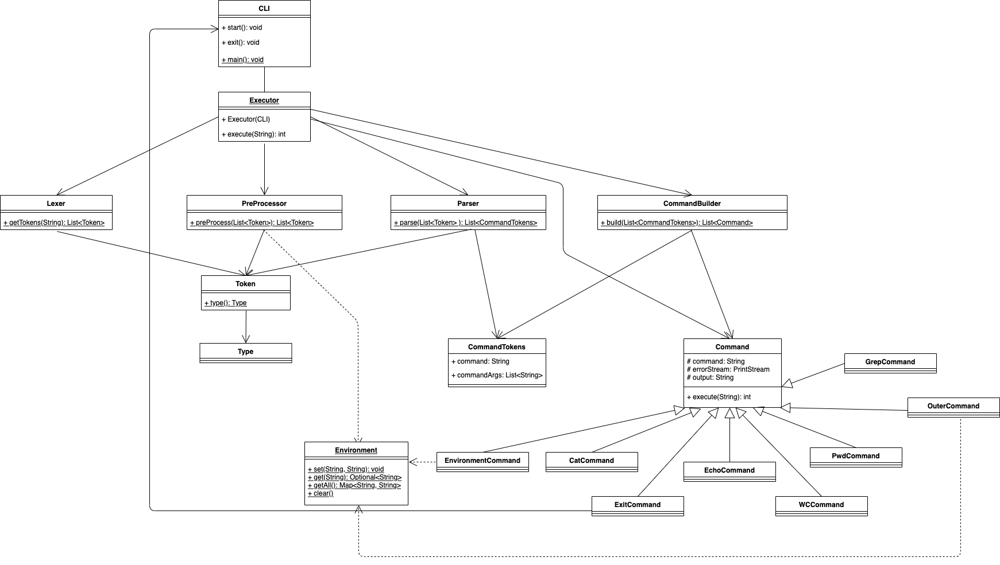

# Архитектура CLI

## Общее описание

Есть главная компонента `CLI`, принимающая на вход команду от пользователя. Данная команда передается в `Executor`, а
после разделяется на токены в компоненте `Lexer`. Затем происходит предобработка (подстановка переменных окружения) в
компоненте `PreProcessor` и последующее выявление названий команд и их аргументов в компоненте `Parser`.
Компонента `CommandBuilder` принимает перечисление команд и их аргументов в последовательности выполнения (в случае
использования pipe-а), и создает создаёт объекты типа класса `Command`, связывая необходимые потоки ввода и вывода
команд между собой. После этого в компоненте `Executor` происходит последовательный вывод всех команд.

## Детальное описание

### class CLI

Точка входа и выхода из приложения. Класс, с которым взаимодействует пользователь. Внутри себя содержит объекты типов:
_Lexer, PreProccesor, Parser, CommandBuilder_. Связывает между собой результаты работы данных классов.

#### Методы:

* `void start()` - метод для начала работы приложения. При вызове данного метода начинается прием команд из консоли от пользователя,
  вызывается `Executor`.

* `void exit()` - метод, который завершает работу приложения, прекращает прием команд от пользователя из консоли

### class Executor

Сущность для вызова основных компонент приложения (_Lexer_, _PreProcessor_, _Parser_, _CommandBuilder_, исполнение
команд).

#### Методы:

* `int execute(String commandString)` - метод, принимающий на вход введенную пользователем строку и вызывающий
  необходимые компоненты в нужном порядке.

  **Алгоритм обработки команд:**
    1. Cтрока, введенная пользователем, передается в класс `Lexer`, на выход из него получается список токенов
    2. Полученный список токенов передается в класс `PreProcessor`, в котором выполняется подстановка
    3. Полученный список токенов с выполненной подстановкой передается в класс `Parser`, на выход получается
       список `CommandTokens`
    4. `CommandTokens` передается в `CommandBuilder`, на выход получается список `Command`
    5. У каждого элемента в этом списке вызывается метод `execute()`. То, что будет находиться у последнего элемента
       в строке `output` и будет результатом выполнения программы
    6. Полученный результат выводится в консоль, после чего программа готова к обработке следующего запроса от
       пользователей

#### Поля:

* `CLI cli` - объект класса, с которым взаимодействует пользователь

### class Lexer

Сущность для разделения входной строки на токены.

#### Методы:

* `List<Token> getTokens(String command)` - метод, который получает на вход всю строку, введенную пользователем, после
  чего делит ее на токены (возвращает список объектов типа Token)

  **Методология разделения:**

  Идем по строке слева направо, набираем символы в текущий токен. Два случая:

    1. Если находимся внутри кавычек (двойных или одинарных), то включаем текущий символ в текущий токен и двигаемся
       дальше
    2. Если находимся вне кавычек, то:

    * Если встретили пробел, то заканчиваем текущий токен, начинаем набирать символы в следующий. Пробелы при этом
      пропускаются.
    * Если встретили символ пайпа, то заканчиваем текущий токен, выделяем пайп в отдельный токен, начинаем набор
      символов для следующего токена

  При этом для каждого токена данный метод определяет, нужно ли в нем выполнять подстановку (были ли использованы
  двойные кавычки), и в зависимости от этого определяется его тип (считаем, что подстановка необходима в случае наличия
  знака доллара, не заключенного в одинарные кавычки или заключенного, но внутри двойных)

### class Token

#### Методы:

* `String getToken()`
* `Type getType()`
* `void setType(Type type)`
* `void setToken(String token)`

#### Поля:

* `String token` - сам токен
* `Type type` - _FULLY_PROCESSED_, если необходимости в подстановках нет, _WEAKLY_PROCESSED_ в противном случае.
  **Замечание:** после подстановки _WEAKLY_PROCESSED_ заменится на _FULLY_PROCESSED_.

### enum Type

Перечисление для типа токена.

* _FULLY_PROCESSED_
* _WEAKLY_PROCESSED_

### class PreProcessor

Сущность для обработки необходимых подстановок в токенах.

#### Методы:

* `List<Token> preProcess(List<Token> tokens)` - метод, обрабатывающий входную последовательность токенов на предмет
  подстановок. Если токен _FullyProcessed_, то с ним ничего не происходит. Если токен _WeaklyProcessed_, то данный метод
  находит в нем переменные, для которых нужно выполнить подстановку и осуществляет ее

  **Методология подстановки:**
    * в токене обнаруживается первый знак `$`
    * набор символов после него (и до символа `$`, `|`, `"`, `'` или `' '`) определяется как имя переменной, для которой
      нужно выполнить подстановку
    * в случае, если имя переменной является пустой строкой, то подстановки не происходит, знак `$` остается в токене
    * найденное имя передается в класс Environment для получения значения соответствующей переменной
    * полученное значение подставляется в токен
    * аналогичные действия выполняются для всех знаков `$` в токене, после чего токен становится _FullyProcessed_
    * в случае, если соответствующая переменная среды не найдена, выбрасывается исключение

  **Замечание**: после подстановки никакой перетокенизации не происходит. Использование кавычек обозначает, что аргумент
  рассматривается как единое целое, а не как набор из обособленных аргументов. После препроцессинга кавычки
  отбрасываются.

### class Environment

Сущность, отвечающая хранение переменных окружения.

#### Методы:

* `void set(String variable, String value)` - метод, который сохраняет название переменной и ее значение. Если название
  уже существует, то перезаписывает значение
* `Optional<String> get(String variable)` - метод, который возвращает значение переменной
* `String[] getAll()` - метод, который возвращает все переменные среды вместе с их значениями
* `void clear()` - метод, удаляющий все переменные среды
* `Path getRelativePath(String path)` - метод, возвращающий путь относительно текущей рабочей директории
* `void setCurrentFolderPath()` - устанавливает рабочую директорию в домашнюю
* `void setCurrentFolderPath(String path)` - устанавливает рабочую директорию в переданный путь относительно текущей директории
* `Path getCurrentFolderPath()` - возвращает рабочую директорию

### class Parser

Сущность для разделения списка токенов на команды и аргументы.

#### Методы:

* `List<CommandTokens> preProcess(List<Token> tokens)` - метод, который получает на вход список токенов, находит среди
  них команды и `|`, и в зависимости от этого разделяет на _CommandTokens_.

  **Методология разделения:**
    * проходим по списку токенов: первый токен является командой, все что следует за ним и до знака `|` (если такой
      есть) - это аргументы для данной команды
    * если в списке есть знак `|`, то первое слово после него будет названием следующей команды
    * аналогично для остальных команд
    * отдельно обрабатывается случай, в котором название команды содержит знак `=`. В этом случае названием команды
      является _environment_, а аргументы получаются из токена со знаком `=`: набор символов до этого знака - это первый
      аргумент, а набор символов после - второй

      **Замечания:**
        * Пробелы до и после `=` не поддерживаются.
        * Если пользователь хочет в качестве значения переменной указать строку с пробелами, необходимо явно заключить
          часть с пробелами в кавычки. Например: `x=hell"o world"`

### class  CommandTokens

Сущность, которая хранит название команды и список аргументов.

#### Поля:

* `String command`
* `List<String> commandArgs`

#### Методы:

* `String getCommand()` - метод, возвращающий название команды
* `List<String> getCommandArgs()` - метод, возвращающий список аргументов команды

### class CommandBuilder

Сущность для преобразования _CommandToken_ в список объектов типа _Command_. Хранит внутри себя список названий и
соответствующие конструкторы.

**Важно**: порядок _CommandToken_ отвечает порядку следования команд в пайпе. Исполнение полученных на выходе _Command_
будет последовательное.

#### Методы:

* `List<Command> build(List<CommandTokens> commandTokens, Path path, CLI cli)` - метод, который обрабатывает поочередно
  каждый _CommandToken_. Если соответствующее ему название есть в списке названий, вызывается соответсвующий
  конструктор. Иначе вызывается конструктор _OuterCommand_.

### abstract class Command

Абстрактный класс для выполнения команд, класс каждой команды будет от него наследоваться.

#### Методы:

* `int execute()` - метод, который возвращает `0` в случае успешного исхода операции

#### Поля:

* `String command` - сама команда
* `PrintStream errorStream` - поток ошибок
* `String output` - вывод команды

#### Наследники (реализации):

Если кол-во аргументов команды передается некорректно, бросается исключение.

* _**CatCommand**_ - команда, которая читает содержимое файла в стандартный поток вывода. Если файл отсутствует, чтение
  происходит со стандартного ввода

* _**EchoCommand**_ - команда, которая выводит в стандартный вывод переданные аргументы, разделенные символом пробела,
  прибавляя в конце символ переноса строки

* _**ExitCommand**_ - команда, которая принимает на вход ссылку на класс `CLI` и вызывает у него метод `exit()`

* _**WCCommand**_ - команда, которая выводит в стандартный вывод количество строк, слов и байт, содержащихся во входном
  файле или в стандартном вводе (если файл не специфицирован).

* _**PwdCommand**_ - команда, которая выводит в стандартный вывод абсолютный путь до текущей рабочей директории

* _**OuterCommand**_ - команда, осуществляющая вызов внешней программы, директории поиска которой указаны в переменной
  окружения _Path_.
  Переменные среды текущего процесса задаются в качестве переменных среды дочернего процесса. В качестве аргумента
  принимает относительное имя внешней программы

* _**EnvironmentCommand**_ - команда, которая устанавливает значение переменной среды. В качестве аргументов принимает
  название переменной и значение. Название команды - зарезервированное ключевое слово _environment_

* _**GrepCommand**_ - команда, которая принимает на вход регулярное выражение `pattern` и выводит строки файла 
(или стандартного ввода, если файл не был передан), в которых `pattern` был найден. 

* _**LsCommand**_ - команда, которая принимает на вход имя директории (или ничего) и выводит список
файлов и поддиректорий в ней .
* _**CdCommand**_ - команда, которая меняет рабочую директорию на путь, переданный в аргументах, относительно текущей рабочей директории.

## UML диаграмма:

