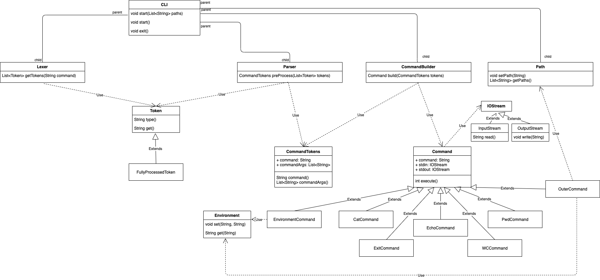

# Архитектура CLI

## Общее описание
Есть главная компонента `CLI`, принимающая на вход команду от пользователя. Данная команда разделяется на токены в компоненте `Lexer`, после чего происходит предобработка (подстановка переменных окружения) в компоненте `PreProcessor` и последующее выявление названий команд и их аргументов в компоненте `Parser`. Компонента `CommandBuilder` принимает перечисление команд и их аргументов в последовательности выполнения (в случае использования pipe-а), и создает класс `Command`, связывая необходимые потоки ввода и вывода команд между собой. После этого в главной компоненте `CLI` происходит последовательный вывод всех команд. 

## Детальное описание

### class CLI
Точка входа и выхода из приложения. Класс, с которым взаимодействует пользователь.
Внутри себя содержит объекты типов: _Lexer, PreProccesor, Parser, CommandBuilder, Path_. Связывает между собой результаты работы данных классов.

#### Методы:
* `void start() / void start(List<String> paths)` - метод для начала работы приложения.
В качестве аргумента можно передать директории для поиска внешних команд.
По умолчанию поиск внешних команд осуществляется в _usr_ и _usr/bin_.
При вызове данного метода начинается прием команд из консоли от пользователя.

    **Алгоритм обработки команд:**
    1. Cтрока, введенная пользователем, передается в класс `Lexer`, на выход из него получается список токенов
    2. Полученный список токенов передается в класс `PreProcessor`, в котором выполняется подстановка
    3. Полученный список токенов с выполненной подстановкой передается в класс `Parser`, на выход получается список `CommandTokens`
    4. `CommandTokens` передается в `CommandBuilder`, на выход получается список `Command`
    5. У каждого элемента в этом списке вызывается метод `execute()`. То, что будет находиться у последнего элемента в `OutputStream` и будет результатом выполнения программы
    6. Полученный результат выводится в консоль, после чего программа готова к обработке следующего запроса от пользователей

* `void exit()` - метод, который завершает работу приложения, прекращает прием команд от пользователя из консоли 

### class Lexer
Сущность для разделения входной строки на токены.

#### Методы:
* `List<Tokens> getTokens(String command)` - метод, который получает на вход всю строку, введенную пользователем, после чего делит ее на токены (возвращает список объектов типа Token)
       
    **Методология разделения:** 
    * токены разделяются по пробелам. При этом, если внутри входа содержится строка в одинарных или двойных кавычках, то она целиком выделяется в один токен
    * при этом для каждого токена данный метод определяет, нужно ли в нем выполнять подстановку, и в зависимости от этого определяется его тип (считаем, что подстановка необходима в случае наличия знака доллара, не заключенного в одинарные кавычки)

 
### interface Token

#### Методы:
* `String type()` - метод, возвращающий тип токена
* `String get()` - метод, возвращающий готовое к использованию значение токена
  
#### Наследники (реализации):
Дополнительно хранят в качестве поля токен в виде строки.

* _**class FullyProcessedToken**_ - токен, готовый к использованию, `get()` возвращает строку без необходимости дополнительных подстановок
* _**class WeaklyProcessedToken**_ - токен, нуждающийся в обработке, `get()` возвращает строку в которой необходимо произвести подстановки

### class PreProcessor
Сущность для обработки необходимых подстановок в токенах.

#### Методы:
* `List<Token> preProcess(List<Token> tokens)` - метод, обрабатывающий входную последовательность токенов на предмет подстановок. Если токен _FullyProcessed_, то с ним ничего не происходит. Если токен _WeaklyProcessed_, то данный метод находит в нем переменные, для которых нужно выполнить подстановку и осуществляет ее
    
    **Методология подстановки:** 
    * в токене обнаруживается первый знак `$`
    *  набор символов после него определяется как имя переменной, для которой нужно выполнить подстановку
    *  найденное имя передается в класс Environment для получения значения соответствующей переменной 
    *  полученное значение подставляется в токен
    *  аналогичные действия выполняются для всех знаков `$` в токене, после чего токен становится _FullyProcessed_
    *  в случае, если соответствующая переменная среды не найдена, выбрасывается исключение

### class Environment
Сущность, отвечающая хранение переменных окружения.

#### Методы:
* `void set(String, String)` - метод, который сохраняет название переменной и ее значение. Если название уже существует, то перезаписывает значение

* `String get(String)` - метод, который проверяет, что переданное название переменной существует, и если это так, то возвращает её значение, иначе `null`

### class Parser
Сущность для разделения списка токенов на команды и аргументы.

#### Методы:
* `List<CommandTokens> preProcess(List<Token> tokens)` - метод, который получает на вход список токенов, находит среди них команды и `|`, и в зависимости от этого разделяет на _CommandTokens_.
  
    **Методология разделения:** 
    * проходим по списку токенов: первый токен является командой, все что следует за ним и до знака `|` (если такой есть) - это аргументы для данной команды
    * если в списке есть знак `|`, то первое слово после него будет названием следующей команды
    * аналогично для остальных команд
    * отдельно обрабатывается случай, в котором название команды содержит знак `=`. В этом случае названием команды является _environment_, а аргументы получаются из токена со знаком `=`: набор символов до этого знака - это первый аргумент, а набор символов после - второй

### class  CommandTokens
Сущность, которая хранит название команды и список аргументов.

#### Поля:
* `String command`
* `List<String> commandArgs`
#### Методы:
* `String command()` - метод, возвращающий название команды
* `List<String> commandArgs()` - метод, возвращающий список аргументов команды

### class CommandBuilder
Сущность для преобразования _CommandToken_ в список объектов типа _Command_.
Хранит внутри себя список названий и соответсвующие конструкторы.

#### Методы:
* `List<Command> build(List<CommandTokens> tokens)` - метод, который обрабатывает поочередно каждый _CommandToken_. Если соответствующее ему название есть в списке названий, вызывается соответсвующий конструктор. Иначе вызывается конструктор _OuterCommand_. При этом в конструктор передаются _InputStream_ и _OutputStream_ так, чтобы OutputStream предыдущей команды был _InputStream_ следующей

### interface Command
Общий интерфейс для выполнения команд, класс каждой команды будет имплементировать интерфейс.

#### Методы:
* `int execute()` -
метод, который возвращает `0` в случае успешного исхода операции

#### Поля:
* `String command`
* `IOStream stdin`
* `IOStream stdout`
  
#### Наследники (реализации):
Если кол-во аргументов команды передается некорректно, бросается исключение.
* _**CatCommand**_ - команда, которая читает содержимое файла в стандартный поток вывода. Если файл отсутствует, чтение происходит со стандартного ввода

* _**EchoCommand**_ - команда, которая выводит в стандартный вывод переданные аргументы, разделенные символом пробела, прибавляя в конце символ переноса строки

* _**ExitCommand**_ - команда, которая принимает на вход объект класса и вызывает у него метод `exit()`
  
* _**WCCommand**_ - команда, которая выводит в стандартный вывод количество строк, слов и байт, содержащихся во входном файле или в стандартном вводе (если файл не специфицирован).  

* _**PwdCommand**_ - команда, которая выводит в стандартный вывод абсолютный путь до текущей рабочей директории

* _**OuterCommand**_ - команда, осуществляющая вызов внешней программы, директории поиска которой указаны в _Path_. Переменные среды текущего процесса задаются в качестве переменных среды дочернего процесса. В качестве аргумента принимает относительное имя внешней программы

* _**EnvironmentCommand**_ - команда, которая устанавливает значение переменной среды. В качестве аргументов принимает название переменной и значение. Название команды - зарезервированное ключевое слово _environment_

### class Path
Хранит пути до директорий, содержащих внешние программы.

#### Методы:
* `void setPath(String)`
* `List<String> getPaths()`

### class IOStream
Хранит в себе нужный поток (ввода или вывода). 

#### Наследники:
* _**InputStream**_ - содержит метод `String read()`
* _**OutputStream**_ - содержит метод `void write(String)`

## Этапы реализации

### Этап I (без подстановок и пайплайнов)
Не реализуем классы `WeaklyProcessedToken`  и `PreProcessor`, в классах `Parser` и `CommandBuilder` передаем и получаем на вход по одному объекту, а не списки. В случае, если на данном этапе подразумевается, что переменные среды не поддерживаются ни в каком виде (не только для подстановок), то так же не реализуем классы `EnvironmentCommand` и `Environment`.

### Этап II
Реализуем недостающие классы, добавляем списки.

